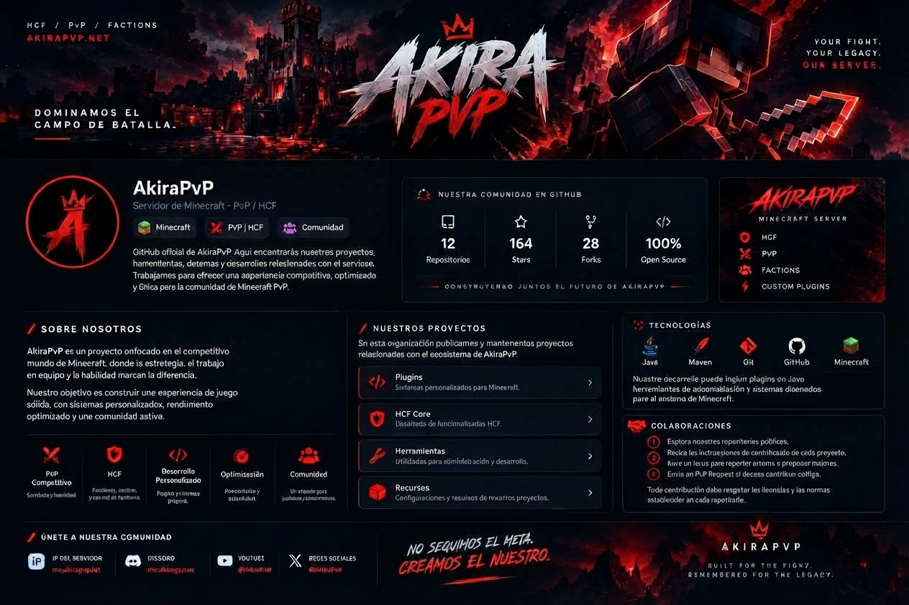

# ⚔️ AKIRAPVP

### DOMINAMOS EL CAMPO DE BATALLA.

**Your fight. Your legacy. Our server.**

**IP DEL SERVIDOR: `akirapvp.lat`**

---

## 🏯 Sobre AkiraPvP

**AkiraPvP** es un proyecto centrado en la experiencia competitiva de Minecraft. Buscamos construir una comunidad donde la estrategia, el trabajo en equipo y la habilidad marquen la diferencia.

Este GitHub reúne nuestros proyectos, herramientas, sistemas y desarrollos relacionados con el servidor.

- ⚔️ **PvP competitivo:** combate basado en habilidad y estrategia.
- 🛡️ **HCF y Factions:** equipos, facciones y control de territorio.
- ⚙️ **Desarrollo personalizado:** plugins y sistemas propios.
- 🚀 **Optimización:** estabilidad y rendimiento.
- 🤝 **Comunidad:** construimos el proyecto junto a nuestros jugadores.

## 🎮 Conéctate al servidor

| Información | Detalles |
|---|---|
| **IP** | `akirapvp.lat` |
| **Modalidad** | PvP / HCF |
| **Discord** | Próximamente |
| **YouTube** | Próximamente |

> Copia `akirapvp.lat` en la dirección del servidor de Minecraft para conectarte.

## 💻 Nuestros proyectos

Publicamos y mantenemos proyectos relacionados con el ecosistema de AkiraPvP. La disponibilidad y el código de cada proyecto dependen de su repositorio.

| Proyecto | Descripción |
|---|---|
| ⚙️ **Plugins** | Sistemas personalizados para Minecraft. |
| 🛡️ **HCF Core** | Funcionalidades y sistemas para HCF. |
| 🔧 **Herramientas** | Utilidades para administración y desarrollo. |
| 📦 **Recursos** | Configuraciones y recursos de los proyectos. |

## 🛠️ Tecnologías

Nuestro desarrollo puede incluir plugins en Java, herramientas de administración y sistemas para el entorno de Minecraft.

## 🤝 Colabora con nosotros

¿Quieres contribuir al desarrollo de AkiraPvP?

1. Explora nuestros repositorios públicos.
2. Lee las instrucciones y la licencia de cada proyecto.
3. Abre un **Issue** para reportar errores o proponer mejoras.
4. Envía un **Pull Request** con tus cambios.

Las contribuciones deben respetar las normas y licencias establecidas en cada repositorio.

## 🌐 Comunidad

- 🎮 **Servidor:** [`akirapvp.lat`](https://akirapvp.lat)
- 💬 **Discord:** Próximamente
- 📺 **YouTube:** Próximamente
- 📸 **Redes sociales:** Próximamente

*Los enlaces sociales se actualizarán cuando estén disponibles los enlaces oficiales.*

---

### NO SEGUIMOS EL META. CREAMOS EL NUESTRO.

**AKIRAPVP**

*Built for the fight. Remembered for the legacy.*

